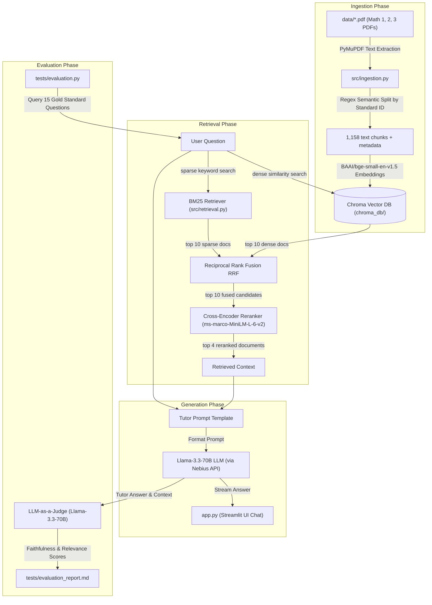
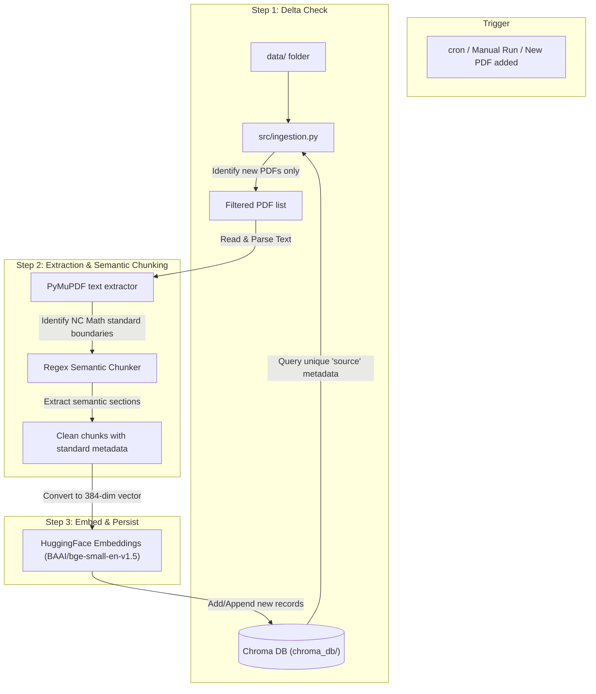
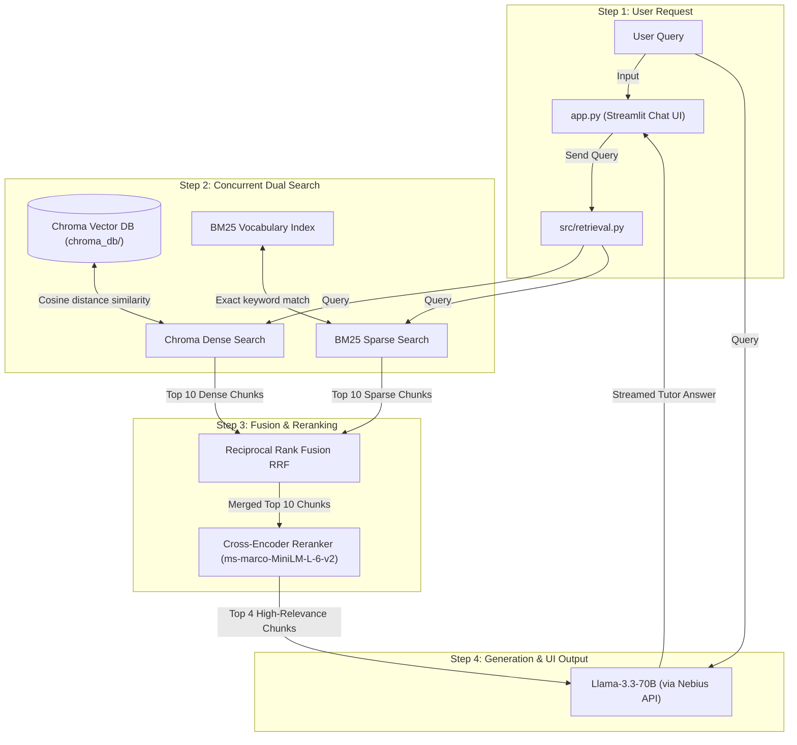

# NC Math 1, 2, & 3 Hybrid RAG Tutor

A Retrieval-Augmented Generation (RAG) system built over the Wake County North Carolina Math 1, 2, and 3 curriculum unpacking guides. It features incremental semantic ingestion, a high-accuracy hybrid search and reranking pipeline, a Streamlit interface acting as a "Patient Math Tutor," and a concurrent evaluation suite.

---

## 🏗️ System Architecture & RAG Pipeline Flow



---

## ⚙️ Functional Block Views

### 1. Ingestion Pipeline (Offline/Scheduled Refresh Activity)
This process runs periodically (or manually) when new curriculum guidelines are added to `data/`. It implements **incremental checks** to avoid duplicate indexing.



### 2. Retrieval & Query Pipeline (Real-time / User Triggered)
This runs in real-time on every query a student or parent submits:



---

## 🛠️ Checklist of What Was Implemented & Tested

### Core RAG Implementation
- [x] **Raw Data Store:** Set up the `data/` folder and ingested official Math 1, 2, and 3 unpacking PDFs.
- [x] **Incremental Parser (`src/ingestion.py`):**
  - Parses PDFs using PyMuPDF (`fitz`).
  - Semantically chunks documents based on Regex boundaries identifying Math Standard IDs (e.g., `NC.M1.A-APR.1`).
  - Queries existing records in Chroma DB to **skip already indexed PDFs** and **prevent duplication**.
- [x] **Local Embedding & Vector Store (`chroma_db/`):**
  - Configured local Chroma DB to avoid external API overhead.
  - Implemented local embeddings with `BAAI/bge-small-en-v1.5`.
- [x] **Hybrid Retriever (`src/retrieval.py`):**
  - Combined Chroma dense similarity search with BM25 sparse keyword search.
  - Merged results using Reciprocal Rank Fusion (RRF).
  - Reranked candidates with a local Cross-Encoder model (`ms-marco-MiniLM-L-6-v2`).
- [x] **Tutor Interface (`app.py`):**
  - Designed Streamlit chat UI configured with `meta-llama/Llama-3.3-70B-Instruct` on Nebius.
  - Configured prompt grounding to enforce math tutor behavior and syllabus-only answering.
  - Added source tracing with expandable metadata card display.

### Testing & Validation
- [x] **Concurrent Evaluation Suite (`tests/evaluation.py`):**
  - Programmed a multithreaded test suite using `ThreadPoolExecutor` to concurrently evaluate a 15-question gold standard set.
  - Integrated an LLM-as-a-judge system using Llama-3.3-70B to evaluate both **Faithfulness** and **Relevance** on a 1-5 scale.
- [x] **Report Generation:** Generates a structured markdown log of all questions and score cards in [`tests/evaluation_report.md`](tests/evaluation_report.md).
- [x] **Retrieval Latency Verification:** Verified average retrieval latency is under **0.60 seconds**.
- [x] **Grounding Verification:** Validated tutor responses have a **4.73 / 5.00** faithfulness score, confirming robust grounding.
- [x] **Fallback Logic:** Confirmed that out-of-scope questions (e.g. comparing cell phone plans when context is absent) correctly trigger the fallback message: *"I cannot find this in our syllabus, please ask your teacher."*

---

## 🚀 How to Run the App

1. Ensure your Nebius API key is configured in `Wake-County-RAG/.env`:
   ```env
   NEBIUS_API_KEY="your-api-key"
   NEBIUS_BASE_URL="https://api.studio.nebius.ai/v1/"
   ```
2. Start the Streamlit application:
   ```bash
   uv run streamlit run Wake-County-RAG/app.py
   ```
3. Open your browser and navigate to the local URL (usually `http://localhost:8501`) to start chatting with your Patient Math Tutor!
